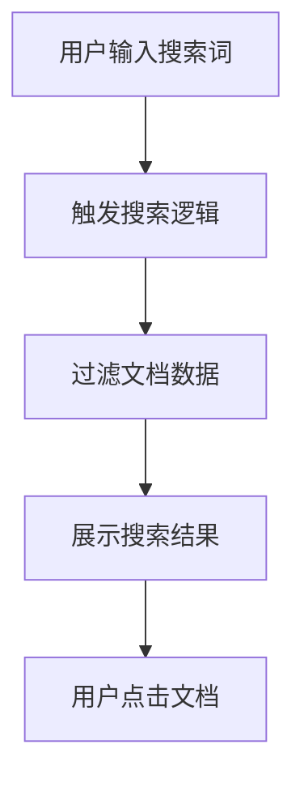

## 1. Product Overview
搜索文档的前端界面，提供搜索框和搜索结果列表功能，用于快速检索和展示文档内容。

## 2. Core Features

### 2.1 Feature Module
1. **搜索页面**: 搜索框、搜索列表展示
2. **搜索结果**: 文档卡片、标题、摘要、标签

### 2.3 Page Details
| Page Name | Module Name | Feature description |
|-----------|-------------|---------------------|
| 搜索页面 | 搜索框 | 支持实时输入搜索、清除按钮、搜索按钮 |
| 搜索页面 | 搜索结果列表 | 展示匹配的文档卡片，包含标题、摘要、标签 |
| 搜索页面 | 空状态 | 显示搜索提示或无结果提示 |

## 3. Core Process
用户在搜索框输入关键词，页面实时过滤并展示匹配的文档结果。

## 4. User Interface Design
### 4.1 Design Style
- 主色调：深蓝 (#1e3a8a) 和青色 (#06b6d4)
- 按钮风格：圆角、渐变背景
- 字体：使用现代无衬线字体
- 布局风格：卡片式布局
- 图标风格：简洁线条图标

### 4.2 Page Design Overview
| Page Name | Module Name | UI Elements |
|-----------|-------------|-------------|
| 搜索页面 | 搜索框 | 深色背景、圆角、输入动画、悬停效果 |
| 搜索页面 | 搜索结果 | 卡片网格、悬停阴影、淡入动画 |
| 搜索页面 | 整体布局 | 居中容器、舒适间距 |

### 4.3 Responsiveness
桌面端：卡片网格布局；移动端：单列布局，响应式适配。

