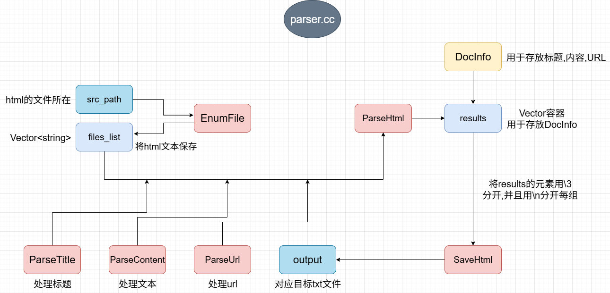
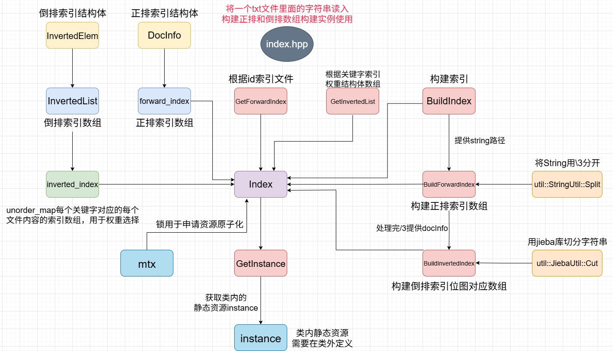
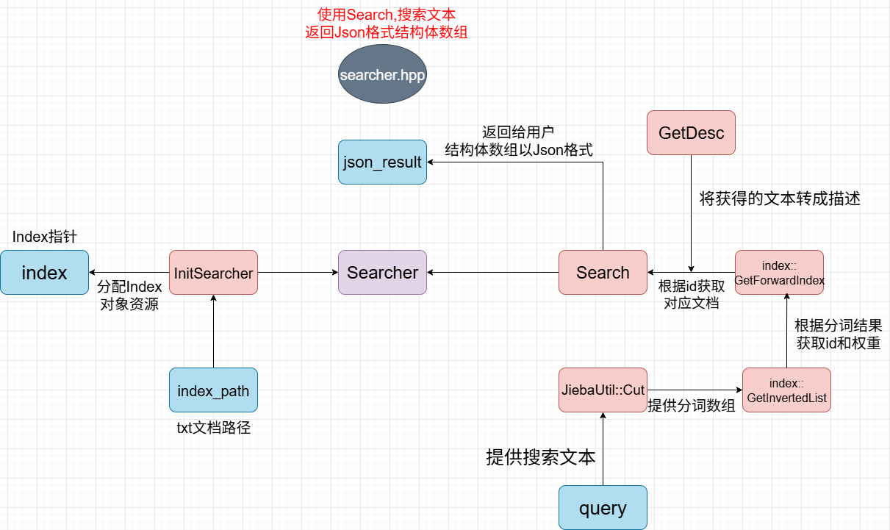

# Boost搜索引擎

#### 安装教程

-  make指令构建parser,debug,server

-  ./parser生成搜索文档raw.txt文件
-  ./server启动服务,启动服务会构建index索引,可能需要几秒时间构建
-  访问http://localhost:8080来测试

#### API接口
http://localhost:8080/hi?query=关键词

- 返回JSON格式的搜索结果,包含权重,标题,描述,链接

#### 项目架构

项目架构主要有三个

- 预处理(parser)：从一堆 HTML 文件中提取有用信息（标题、正文、URL），并把它们写入一个统一的原始数据文件中（raw.txt）

- 索引构建(index)：为搜索引擎构建正排索引和倒排索引，从而让你输入关键词就能快速查到网页内容

- 搜索模块(searcher)：负责在已经建立好的索引中查找用户输入的关键词，并把结果转换成 JSON 格式返回给前端

- Web 服务端程序(server)：启动一个能接收前端请求的后端接口

### 核心特性

- 中文分词：使用 cppjieba 进行中文分词
- 权重计算：标题权重比正文更高，提供更准确的搜索排序
- 大小写不敏感：搜索时忽略大小写
- 文档摘要：自动提取关键词周边内容作为摘要

### 依赖库

- Boost：文件系统操作
- cppjieba：中文分词
- cpp-httplib：HTTP 服务器
- jsoncpp：JSON 数据处理

### 项目结构

>.\
>├── parser.cpp # HTML解析器\
>├── index.hpp # 索引模块\
>├── searcher.hpp # 搜索模块\
>├── server.cpp # Web服务器\
>└── util.hpp # 工具类